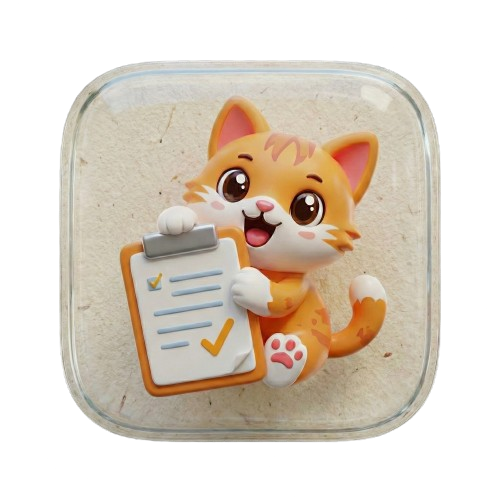

<p align="center">
  
</p>
<div align="center">
<h1>Clipussy</h1>
</div>

A creative and stylish clipboard manager built with Wails that helps you keep track of your copied content with a unique paper-aesthetic interface. PLEASE READ: (Clipboard + pussycat(logo) = Clipussy) i am beating the allegations


## 📥 Download

**[⬇️ Download the latest installer (v0.1.0)](https://github.com/d3uceY/Clipussy/releases/tag/v0.1.0)**

Get the Windows installer from the latest release and start managing your clipboard with style!

## ✨ Features

- 🔄 **Automatic Clipboard Monitoring** - Automatically captures everything you copy
- 📌 **Pin Important Clips** - Keep your most-used clips at the top
- 🔍 **Fast Search** - Quickly find clips with Ctrl+F
- 🎨 **Unique Paper Aesthetic** - Beautiful hand-drawn, notebook-style UI
- 🗑️ **Easy Management** - Copy, pin, and delete clips with intuitive controls
- 🔊 **Sound Effects** - Audible feedback for actions (toggleable)
- 💾 **Persistent Storage** - SQLite database keeps your clips safe
- 🎯 **Smart Cleanup** - Automatically maintains the 100 most recent clips

## 🛠️ Technologies Used

### Backend
- **[Go](https://golang.org/)** - Core application logic
- **[Wails v2](https://wails.io/)** - Desktop application framework
- **[SQLite](https://www.sqlite.org/)** (via modernc.org/sqlite) - Local database for clip storage
- **[atotto/clipboard](https://github.com/atotto/clipboard)** - Cross-platform clipboard access
- **Windows API** (lxn/win) - Native Windows clipboard monitoring

### Frontend
- **[React 18](https://react.dev/)** - UI framework
- **[TypeScript](https://www.typescriptlang.org/)** - Type-safe JavaScript
- **[Vite](https://vitejs.dev/)** - Fast build tool and dev server
- **[Tailwind CSS](https://tailwindcss.com/)** - Utility-first CSS framework
- **[shadcn/ui](https://ui.shadcn.com/)** - Accessible component library
- **[GSAP](https://greensock.com/gsap/)** - Animation library
- **[Lucide React](https://lucide.dev/)** - Icon library

## 🏗️ Architecture

Clipussy follows a clean architecture pattern with clear separation between frontend and backend:

```
┌─────────────────────────────────────────────────┐
│                   Frontend (React)               │
│  ┌────────────┐  ┌──────────┐  ┌──────────┐    │
│  │  UI Layer  │  │ Context  │  │ Components│    │
│  │  (TSX/CSS) │  │ Provider │  │  (Cards)  │    │
│  └────────────┘  └──────────┘  └──────────┘    │
└──────────────────────┬──────────────────────────┘
                       │ Wails Bridge (IPC)
┌──────────────────────┴──────────────────────────┐
│                Backend (Go)                      │
│  ┌────────────┐  ┌──────────┐  ┌──────────┐    │
│  │   App.go   │  │ clips.go │  │  db.go   │    │
│  │  (Bridge)  │  │ (Logic)  │  │(Storage) │    │
│  └────────────┘  └──────────┘  └──────────┘    │
└──────────────────────┬──────────────────────────┘
                       │
          ┌────────────┴────────────┐
          │                         │
    ┌─────▼─────┐          ┌────────▼────────┐
    │  SQLite   │          │ OS Clipboard    │
    │ Database  │          │   Listener      │
    └───────────┘          └─────────────────┘
```

### Data Flow

1. **Clipboard Monitoring**
   - Windows clipboard listener runs in the background
   - Detects clipboard changes via Windows API
   - Filters out duplicate or empty content

2. **Data Storage**
   - New clips are saved to SQLite database
   - Automatic cleanup keeps only 100 most recent clips (prioritizing pinned)
   - Each clip stores: content, type, timestamp, and pinned status

3. **Frontend Updates**
   - Backend emits events when clipboard changes
   - React context manages clip state
   - UI automatically re-renders with new data

4. **User Actions**
   - Copy: Uses browser clipboard API
   - Pin/Unpin: Toggles database flag, reorders UI
   - Delete: Removes from database, refreshes list
   - Search: Client-side filtering with instant results

## 📂 Project Structure

```
Clipussy/
├── app.go                      # Main application entry point
├── clips.go                    # Clip CRUD operations
├── db.go                       # Database initialization
├── main.go                     # Wails runtime setup
├── go.mod                      # Go dependencies
├── wails.json                  # Wails configuration
├── internal/
│   └── clipboard/
│       └── listener_window.go  # Windows clipboard listener
├── frontend/
│   ├── src/
│   │   ├── App.tsx            # Root component
│   │   ├── components/
│   │   │   ├── page.tsx       # Main page layout
│   │   │   └── ui/
│   │   │       ├── clip-card.tsx   # Individual clip card
│   │   │       └── dialog.tsx      # Modal dialog
│   │   ├── context/
│   │   │   └── ClipContext.tsx     # Global state management
│   │   ├── helpers/
│   │   │   ├── formatTime.ts       # Date formatting
│   │   │   └── playSound.ts        # Audio feedback
│   │   └── types/
│   │       └── clip.ts             # TypeScript interfaces
│   ├── wailsjs/                    # Auto-generated Wails bindings
│   ├── public/                     # Static assets
│   ├── package.json
│   └── vite.config.ts
└── build/                          # Build configuration
    └── windows/
        └── installer/              # NSIS installer config
```

## 🔧 How It Works

### Backend Implementation

**Clipboard Monitoring** (`internal/clipboard/listener_window.go`)
```go
// Polls clipboard every 500ms using Windows API
// Compares clipboard sequence numbers to detect changes
// Invokes callback when new content is detected
```

**Database Schema** (`db.go`)
```sql
CREATE TABLE clips (
    id INTEGER PRIMARY KEY AUTOINCREMENT,
    content TEXT NOT NULL,
    type TEXT NOT NULL,
    pinned BOOLEAN DEFAULT 0,
    created_at DATETIME DEFAULT CURRENT_TIMESTAMP
)
```

**Key Operations** (`clips.go`)
- `getClips()` - Fetches all clips ordered by pinned status, then by date
- `addClip()` - Inserts new clip and maintains 100-clip limit
- `togglePinClip()` - Toggles pinned status by ID
- `deleteClip()` - Removes clip from database

### Frontend Implementation

**State Management** (`ClipContext.tsx`)
- Global state using React Context API
- Splits clips into pinned and recent arrays
- Listens for clipboard events from backend
- Provides `getClips()` method for manual refresh

**UI Components**
- **ClipCard** - Individual clip with copy/pin/delete actions
- **Page** - Main layout with search, pinned section, recent section
- **Dialog** - About modal with app information

**Animations** (GSAP)
- Paper curtain reveal on startup
- Cat character entrance
- Info button nudge animation
- Sound effects on interactions

## 🚀 Getting Started

### Prerequisites
- Go 1.24 or higher
- Node.js 18+ and npm
- Wails CLI: `go install github.com/wailsapp/wails/v2/cmd/wails@latest`

### Development

1. **Clone the repository**
   ```bash
   git clone https://github.com/d3uceY/clipussy.git
   cd clipussy
   ```

2. **Install dependencies**
   ```bash
   # Backend dependencies
   go mod download
   
   # Frontend dependencies
   cd frontend
   npm install
   cd ..
   ```

3. **Run in development mode**
   ```bash
   wails dev
   ```

   The app will launch with hot-reload enabled for both frontend and backend.

### Building

**Development Build**
```bash
wails build
```

**Production Build with NSIS Installer (Windows)**
```bash
wails build -nsis
```

The built application will be in `build/bin/`.

## 📝 Database Location

Clips are stored in a SQLite database at:
```
Windows: %APPDATA%\clipussy\db\gyatt.db
```

## ⌨️ Keyboard Shortcuts

- `Ctrl + F` - Focus search bar
- `Ctrl + C` - Copy selected text (triggers clipboard monitoring)

## 🎨 Customization

### Changing Clip Limit
Edit `clips.go`, line 64:
```go
LIMIT 100  // Change this number
```

### Adjusting Sound Volume
Edit respective handlers in `clip-card.tsx` and `page.tsx`:
```typescript
playSound("/sounds/file.mp3", soundOn, 0.3)  // 0.0 to 1.0
```

### Modifying UI Colors
Edit `frontend/src/index.css` and Tailwind classes in components.

## 🤝 Contributing

Contributions are welcome! Feel free to submit issues and pull requests.

## 👨‍💻 Author

**Onyekwelu Jesse** ([@d3uceY](https://github.com/d3uceY))

## 📄 License

This project is licensed under the MIT License.

## 🙏 Acknowledgments

- [Wails](https://wails.io/) for the amazing Go + Web framework
- [shadcn/ui](https://ui.shadcn.com/) for the beautiful component library
- All open-source contributors whose libraries made this possible

---

Made with 💜 by d3uceY
